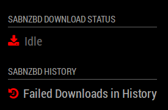

# Module: Check Status via JSON API Calls (MMM-JSONStatusChecker)

This is a module for <a href="https://github.com/MichMich/MagicMirror">MagicMirror</a>.

`MMM-JSONStatusChecker` will periodically call a URL and display a "true / false" (or "connected / disconnected) status based on the results of a value in a JSON response from the API call.  

Multiple instances of the module can be used to call different URLs/APIs using the same background helper. Each instance has it's own configuration and refresh time.

### Example:

The AirVPN service provides an API which can be called to check service status and if a user is connected or not from an external source.  This module was originally created to periodically verify that a NAS was still connected to the VPN. 

### Screenshot


## Installation

1. Navigate to your MagicMirror `modules` directory.
2. Execute `git clone https://github.com/shbatm/MMM-JSONStatusChecker`.
3. Add the module to your MagicMirror's `config.js` file (see next section).

## Using the Module

To use this module, add it to the modules array in the `config/config.js` file:

```javascript
modules: [
    ...,
    {
        module: 'MMM-JSONStatusChecker',
        header: 'JSON Status',
        position: 'top_left',
        config: {
                // See Configuration Options below
                }
    },
    ...
]
```

**Note:** Multiple instances of this module can be added to the config and the `node_helper.js` will manage the multiple calls to various locations.

## Configuration options

| Option           | Description
|----------------- |-----------
| `name` | *Required* - The name for this instance of the module.<br />This is used to allow multiple instances of the module with only one `node_helper`.
| `apiKey` | *Optional* Your API Key from the service to be used. Will be injected into the url provided.
| `urlApi` | *Optional* - The URL to call to get the connected status.<br />To inject your API into the URL, add `{{APIKEY}}` into the URL where the API key goes.<br />*Example:* `https://airvpn.org/api/?service=userinfo&format=json&key={{APIKEY}}`
| `updateInterval` | *Optional* - The interval in `ms` for updating the information<br />*Default:* 60000ms (10 minutes)
| `keyToCheck` | *Optional* - The dot-separated path to the key in the JSON response that will be checked. The JSON Response will be recursively checked for the key.<br />*Default:* `user.connected`
| `keyValue` | *Optional* - The value for which to check the `keyToCheck`. The module will evaluate if `JSONResponse[keyToCheck] === keyValue` to determine what status it should show.<br />*Default:* `true`.
| `trueString`,<br />`falseString` | *Optional* - The values to display if the keyValue is true or false, respectively<br />*Default:* `"VPN Connected"` and `"VPN Disconnected"`
| `icon` | *Optional* - The Font Awesome icon to use (omit the `fa-`).<br />*Default:* `plug`.  Set `''` to not show an icon.
| `trueClass`,<br />`falseClass` | *Optional* - The CSS classes to add if the keyValue is true or false, respectively.<br />*Default:* None.
| `showTrueAlert` | *Optional* - Show an alert when the query returns a `true` value.<br />*Default:* `false` (e.g. no alert is shown).
| `showFalseAlert` | *Optional* - Show an alert when the query returns a `false` value.<br />*Default:* `true` (e.g. alert is shown).

## Example Configuration - Check SABnzbd Status
```
{
module: "MMM-JSONStatusChecker",
position: "bottom_left", // This can be any of the regions.
header: "SABnzbd Download Status",
config: {
    // See 'Configuration options' for more information.
    name: "SABnzbd",
    updateInterval: 60000,
    apiKey: "<your api key>",
    urlApi: "http://<server>:<port>/sabnzbd/api?output=json&apikey={{APIKEY}}&mode=queue&limit=0",
    keyToCheck: "queue.status",
    keyValue: "Downloading",
    trueString: "Downloading",
    falseString: "Idle",
    icon: "download",
    trueClass: "small",
    falseClass: "dimmed small",
    showTrueAlert: false,
    showFalseAlert: false,
}
},
{
module: "MMM-JSONStatusChecker",
position: "bottom_left", // This can be any of the regions.
header: "SABnzbd History",
config: {
    // See 'Configuration options' for more information.
    name: "SABnzbd",
    updateInterval: 60000,
    apiKey: "<your api key>",
    urlApi: "http://<server>:<port>/sabnzbd/api?output=json&apikey={{APIKEY}}&mode=history&failed_only=1",
    keyToCheck: "history.noofslots",
    keyValue: 0,
    trueString: "All Downloads Succeeded",
    falseString: "Failed Downloads in History",
    icon: "history",
    trueClass: "dimmed small",
    falseClass: "small",
    showTrueAlert: false,
    showFalseAlert: true,
}
}, 
```

### Screenshot for Above Example



## License

`MMM-JSONStatusChecker` is licensed under the MIT License.
